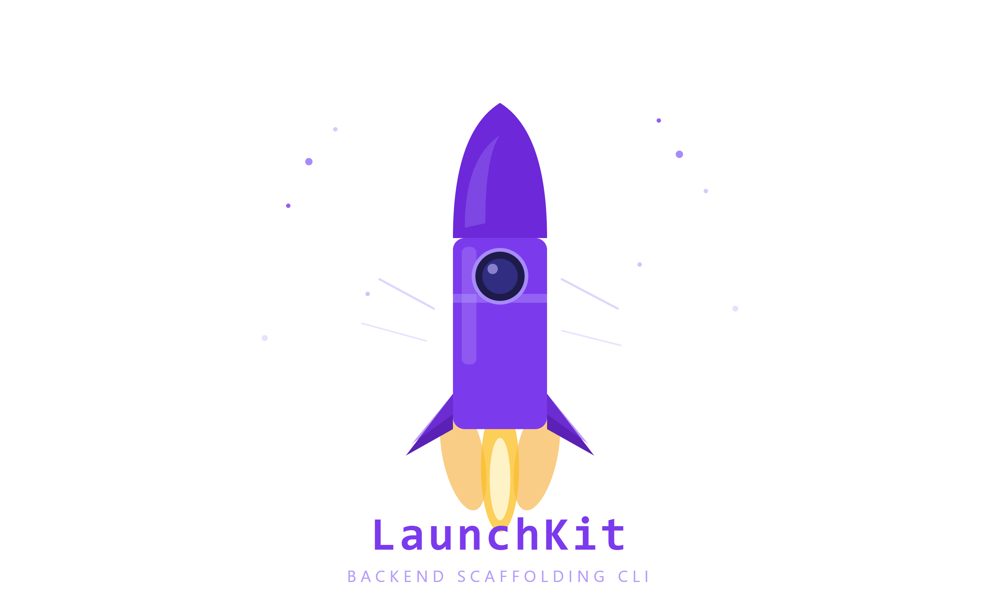

<div align="center">



# 🚀 LaunchKit

### Scaffold production-ready backend projects in seconds — not hours.

[](https://www.npmjs.com/package/@zaidshk04/launchkit)
[](https://www.npmjs.com/package/@zaidshk04/launchkit)
[](./LICENSE)
[](https://nodejs.org)
[](./CONTRIBUTING.md)
[](https://github.com/zaid-shk/LaunchKit/stargazers)

<br />

**LaunchKit** is a modern interactive CLI that generates fully configured Node.js backend projects.  
Answer a few prompts. Get a production-ready backend. Ship faster.

<br />

[**Quick Start**](#-quick-start) · [**Features**](#-features) · [**CLI Walkthrough**](#-cli-walkthrough) · [**Roadmap**](#-roadmap) · [**Contributing**](#-contributing)

<br />

</div>

---

## 🤔 Why LaunchKit?

Setting up a backend project is repetitive. Every time you start something new, you're doing the same thing — installing packages, wiring up auth, connecting a database, configuring TypeScript, structuring folders.

**LaunchKit eliminates that.**

```bash
npx @zaidshk04/launchkit
```

One command. A few prompts. A complete, configured backend — ready to run.

> Instead of spending 30–60 minutes on boilerplate, you're writing real features in under a minute.

---

## ✨ Features

### ⚙️ Core

| Feature | Details |
|---|---|
| 🖥️ Interactive CLI | Friendly prompts powered by `@clack/prompts` |
| 📝 Language Support | JavaScript & TypeScript |
| 📦 Module Systems | CommonJS (CJS) & ES Modules (ESM) |
| 🌐 Framework | Express.js |
| 🗂️ Project Structure | Clean, scalable folder layout |
| ⚡ Auto Install | Dependencies installed automatically |

### 🔐 Authentication

| Option | Description |
|---|---|
| JWT | Stateless token-based auth with `jsonwebtoken` |
| Passport.js | Flexible, strategy-based authentication |
| Express Session | Traditional server-side session auth |

### 🗄️ Databases

| Database | Type |
|---|---|
| MongoDB | NoSQL document database |
| PostgreSQL | Relational SQL database |
| MySQL | Relational SQL database |

### 🔧 ORM / ODM

| Tool | Compatible With |
|---|---|
| Mongoose | MongoDB |
| Prisma | PostgreSQL, MySQL |
| Drizzle ORM | PostgreSQL, MySQL |

### ✅ Validation

| Library | Style |
|---|---|
| Zod | TypeScript-first schema validation |
| Express Validator | Middleware-based validation |

---

## 🚀 Quick Start

No global install needed. Use your preferred package manager's runner:

```bash
# npm
npx @zaidshk04/launchkit

# pnpm
pnpm dlx @zaidshk04/launchkit

# Yarn
yarn dlx @zaidshk04/launchkit

# Bun
bunx @zaidshk04/launchkit
```

> **Note:** LaunchKit is designed to be run directly with `npx` / `dlx` / `bunx`. Global installation is not recommended, as you'll always get the latest version this way.

---

## 🎬 CLI Walkthrough

Once you run the command, LaunchKit guides you through a short interactive setup:

```
┌  🚀 LaunchKit — Backend Project Scaffolder
│
◇  Project name
│  my-awesome-api
│
◇  Language
│  ● TypeScript   ○ JavaScript
│
◇  Module system
│  ● ES Modules   ○ CommonJS
│
◇  Authentication
│  ● JWT   ○ Passport.js   ○ Express Session   ○ None
│
◇  Database
│  ● PostgreSQL   ○ MongoDB   ○ MySQL   ○ None
│
◇  ORM / ODM
│  ● Prisma   ○ Drizzle ORM   ○ Mongoose   ○ None
│
◇  Validation
│  ● Zod   ○ Express Validator   ○ None
│
◇  Install dependencies?
│  ● Yes   ○ No
│
└  ✅ Project created successfully! Happy shipping 🚢
```

After the prompts, LaunchKit generates your project and (optionally) installs all dependencies automatically.

---

## 📁 Generated Project Structure

Below is an example structure for a **TypeScript + PostgreSQL + Prisma + JWT + Zod** project:

```
my-awesome-api/
├── src/
│   ├── config/
│   │   └── db.ts            # Database connection
│   ├── controllers/
│   │   └── auth.controller.ts
│   ├── middlewares/
│   │   ├── auth.middleware.ts
│   │   └── validate.middleware.ts
│   ├── routes/
│   │   └── auth.routes.ts
│   ├── schemas/
│   │   └── auth.schema.ts   # Zod schemas
│   └── index.ts             # App entry point
├── prisma/
│   └── schema.prisma        # Prisma schema
├── .env.example
├── .gitignore
├── package.json
└── tsconfig.json
```

Every file is pre-configured and ready to run — no manual wiring required.

---

## 🛠️ Tech Stack

LaunchKit itself is built with:

| Technology | Purpose |
|---|---|
| Node.js (ESM) | Runtime |
| `@clack/prompts` | Beautiful interactive CLI prompts |
| `fs-extra` | File system operations |
| `execa` | Dependency installation |

---

## 🗺️ Roadmap

LaunchKit is actively growing. Here's what's coming next:

### 🔜 Coming Soon

- [ ] 🐳 **Docker support** — Dockerfile + Compose templates
- [ ] 📖 **Swagger / OpenAPI** — Auto-generated API docs
- [ ] 🔴 **Redis integration** — Caching & session storage
- [ ] 📧 **Email (Nodemailer)** — Transactional email setup
- [ ] 📁 **File Upload (Multer)** — File handling out of the box
- [ ] 🖼️ **ImageKit / Cloudinary** — Cloud image management
- [ ] 📊 **Logger (Winston / Pino)** — Structured logging

### 🔮 Planned

- [ ] 🛡️ **Helmet** — HTTP security headers
- [ ] 🚦 **Rate Limiting** — API throttling
- [ ] 🧪 **Testing (Jest / Vitest)** — Test scaffolding
- [ ] ⚡ **Fastify support** — High-performance framework
- [ ] 🔥 **Hono support** — Ultrafast web framework
- [ ] 🏗️ **NestJS support** — Opinionated enterprise framework
- [ ] 🔁 **CI/CD templates** — GitHub Actions workflows
- [ ] 🌍 **Environment presets** — dev / staging / production configs
- [ ] 🚀 **Deployment templates** — Railway, Render, Fly.io

---

## 👥 Who Is LaunchKit For?

LaunchKit is built for developers who want to move fast without sacrificing code quality:

- 👨‍💻 **Backend Developers** — Skip the setup, get to the logic
- 🌐 **Full Stack Developers** — Spin up a backend while your frontend is still warm
- 🎓 **Students & Beginners** — Learn best-practice project structure from day one
- 💼 **Freelancers** — Deliver client projects faster
- 🚀 **Startup Developers** — Validate ideas before the coffee gets cold

---

## 🤝 Contributing

Contributions are what make open source thrive. Every pull request, bug report, and feature suggestion matters.

### How to Contribute

1. **Fork** the repository
2. **Clone** your fork
   ```bash
   git clone https://github.com/your-username/launchkit.git
   cd launchkit
   ```
3. **Install dependencies**
   ```bash
   npm install
   ```
4. **Create a branch** for your feature or fix
   ```bash
   git checkout -b feat/your-feature-name
   ```
5. **Make your changes** and commit using [Conventional Commits](https://www.conventionalcommits.org/)
   ```bash
   git commit -m "feat: add docker support"
   ```
6. **Push** and open a **Pull Request**

### Contribution Ideas

- 🐛 Fix a bug or open an issue
- ✨ Implement a feature from the roadmap
- 📖 Improve documentation
- 🧪 Add or improve tests
- 🎨 Improve the CLI experience

Please read [CONTRIBUTING.md](./CONTRIBUTING.md) for detailed guidelines.

---

## ⭐ Star This Repository

If LaunchKit saved you time, **starring the repo** is the best way to support it — it helps more developers discover the project.

[](https://github.com/zaidshk04/launchkit/stargazers)

> Stars motivate continued development and new features. If you're using LaunchKit, let others know with a ⭐.

---

## 🐛 Issues & Support

Found a bug? Have a question? Want to request a feature?

- 🐛 [Open a Bug Report](https://github.com/zaidshk04/launchkit/issues/new?template=bug_report.md)
- 💡 [Request a Feature](https://github.com/zaidshk04/launchkit/issues/new?template=feature_request.md)
- 💬 [Start a Discussion](https://github.com/zaidshk04/launchkit/discussions)

---

## 📄 License

Distributed under the **MIT License**. See [LICENSE](./LICENSE) for full details.

---

## 👤 Author

**Zaid Shaikh**

[](https://github.com/zaid-shk)
[](https://www.npmjs.com/~zaidshk04)

---

<div align="center">

Made with ❤️ by [Zaid Shaikh](https://github.com/zaidshk04)

**If LaunchKit helped you, give it a ⭐ — it means the world.**

</div>